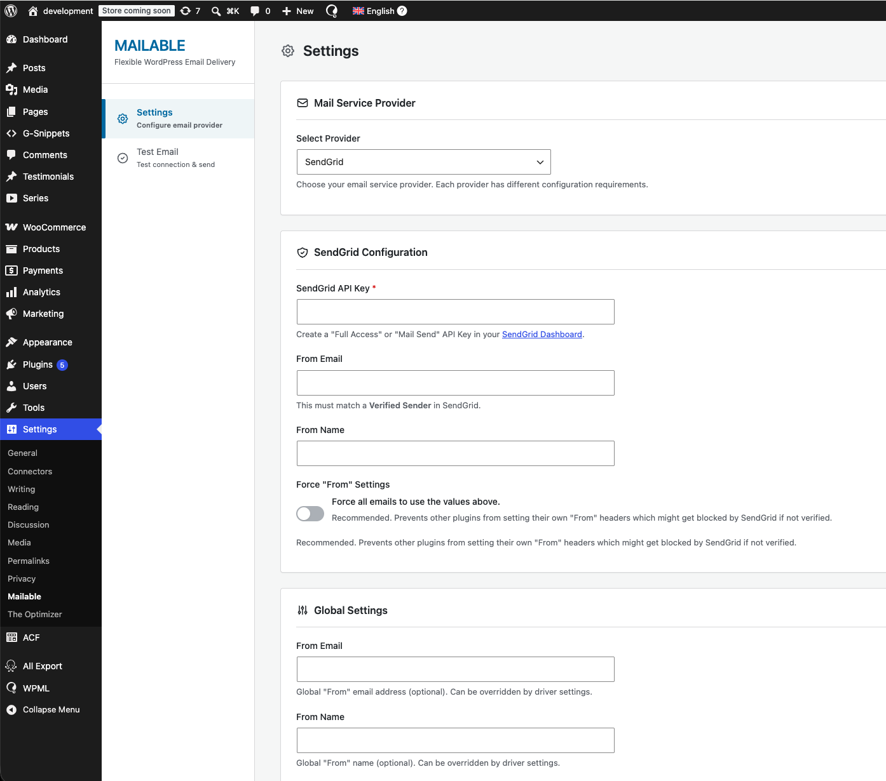
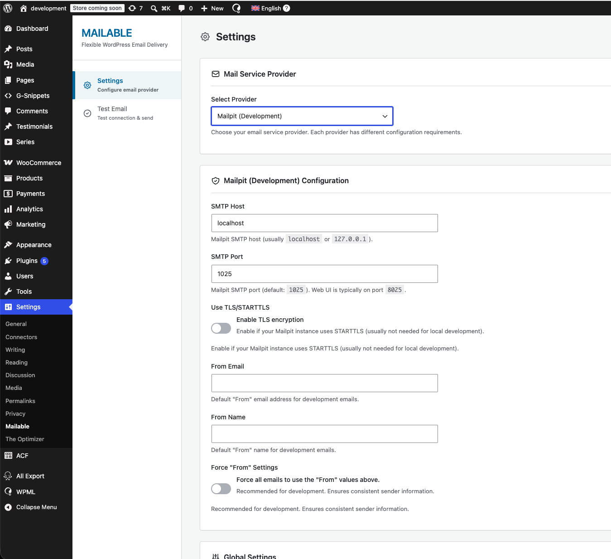
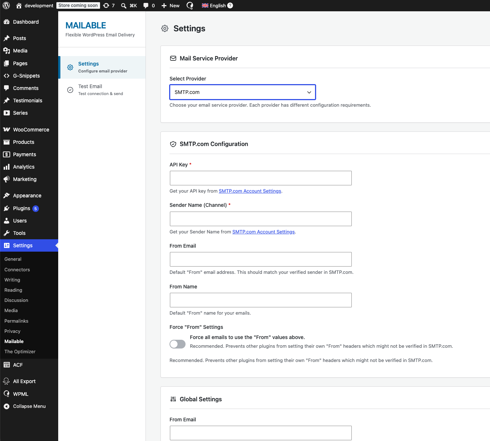
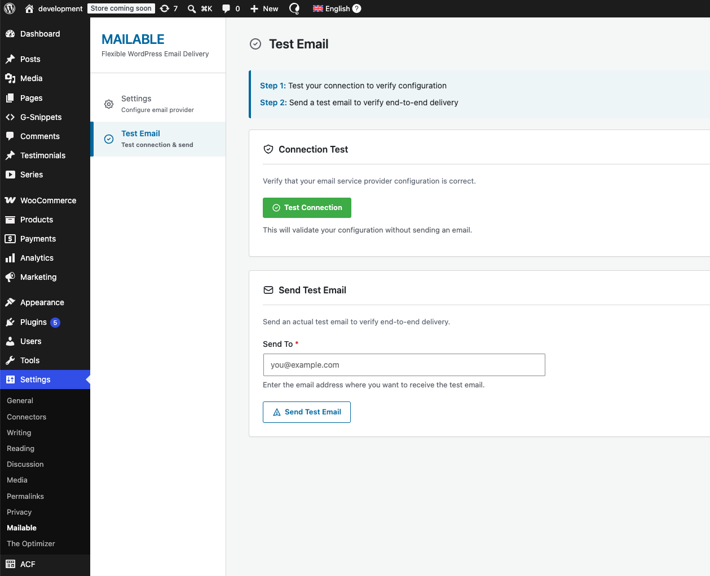

# Mailable

**A flexible WordPress email plugin built on a driver-based architecture — inspired by Laravel's Mail system.**

[](https://wordpress.org/)
[](https://www.php.net/)
[](https://www.gnu.org/licenses/gpl-2.0.html)

---

## What It Does

Mailable replaces WordPress's default email delivery by routing all `wp_mail()` calls through a configurable provider driver (SendGrid, SMTP.com, Mailpit, or any custom driver). A single settings page lets you switch providers, configure credentials, and send test emails — without touching code.

---

## Screenshots

**1. SendGrid configuration** — API key, verified sender, and Force From toggle.



**2. Mailpit (development)** — SMTP host/port pre-filled for local mail catching.



**3. SMTP.com configuration** — API key + sender channel required fields.



**4. Test Email panel** — two-step flow: connection test first, then end-to-end delivery.



---

## Features

- **Driver-based architecture** — each provider is an isolated class; swap providers without side effects.
- **Three built-in drivers** — SendGrid (API), SMTP.com (API), Mailpit (local SMTP dev tool).
- **Extensible via action hook** — third-party plugins register drivers without touching plugin code.
- **Connection test + test email** — validates config before real email is sent.
- **Dynamic settings form** — provider fields swap client-side when the dropdown changes (no page reload).
- **Force From override** — prevents other plugins from overwriting sender headers.
- **WordPress-native settings API** — uses `register_setting`, `add_settings_error`, nonce verification, and capability checks throughout.

---

## Code Style

The plugin follows WordPress Coding Standards with object-oriented PHP:

- **Abstract base class** (`Mail_Driver`) defines the driver contract; concrete drivers implement three abstract methods.
- **Static registry** (`Mail_Driver_Manager`) holds registered drivers and resolves the active one.
- **Single responsibility** — each driver file owns only its provider's PHPMailer configuration and settings fields.
- **WordPress APIs only** — `get_option` / `register_setting` for persistence, `wp_verify_nonce` + `current_user_can` for security, `sanitize_*` helpers for every user input.
- **No external dependencies** — pure PHP 7.4+, no Composer packages required.

---

## Extending: Adding a Custom Driver

### 1. Implement the abstract class

```php
class Mailgun_Driver extends Mail_Driver {

    public function __construct() {
        $this->driver_name  = 'mailgun';
        $this->driver_label = 'Mailgun';
    }

    public function configure_phpmailer( $phpmailer ) {
        $phpmailer->isSMTP();
        $phpmailer->Host     = 'smtp.mailgun.org';
        $phpmailer->SMTPAuth = true;
        $phpmailer->Port     = 587;
        $phpmailer->Username = $this->get_option( 'username' );
        $phpmailer->Password = $this->get_option( 'api_key' );
    }

    public function get_settings_fields() {
        return [
            [ 'key' => 'username', 'label' => 'SMTP Username', 'type' => 'text',     'required' => true ],
            [ 'key' => 'api_key',  'label' => 'API Key',       'type' => 'password', 'required' => true ],
        ];
    }

    public function validate_config() {
        if ( empty( $this->get_option( 'api_key' ) ) ) {
            return new WP_Error( 'missing_key', 'API Key is required.' );
        }
        return true;
    }
}
```

### 2. Register via the provided action hook

```php
add_action( 'mailable_register_drivers', function () {
    require_once plugin_dir_path( __FILE__ ) . 'class-mailgun-driver.php';
    Mail_Driver_Manager::register( 'mailgun', 'Mailgun_Driver' );
} );
```

The new driver appears automatically in the provider dropdown — no changes to Mailable itself.

### Driver contract (`Mail_Driver` abstract methods)

| Method | Purpose |
|---|---|
| `configure_phpmailer( $phpmailer )` | Configure the PHPMailer instance |
| `get_settings_fields()` | Declare admin form fields (key, label, type, required) |
| `validate_config()` | Return `true` or `WP_Error` |
| `test_connection()` | *(optional override)* Live connectivity check |

---

## Good Practices Applied

- **Nonce + capability checks** on every form submission (`wp_verify_nonce`, `current_user_can('manage_options')`).
- **Input sanitization** matched to type — `sanitize_email`, `sanitize_text_field`, `absint` per field.
- **Direct-access guard** — `defined('ABSPATH') || exit` in every file.
- **Selective asset loading** — admin CSS/JS enqueued only on the plugin's own settings page.
- **Settings validation before sending** — `validate_config()` is called inside `phpmailer_init` so a misconfigured driver silently skips rather than throwing.
- **i18n-ready** — all user-facing strings wrapped in `__()` / `esc_html__()` with the `mailable` text domain.

---

*Built by [David Gaitan](https://profiles.wordpress.org/david-gaitan/) · GPL v2 or later*
